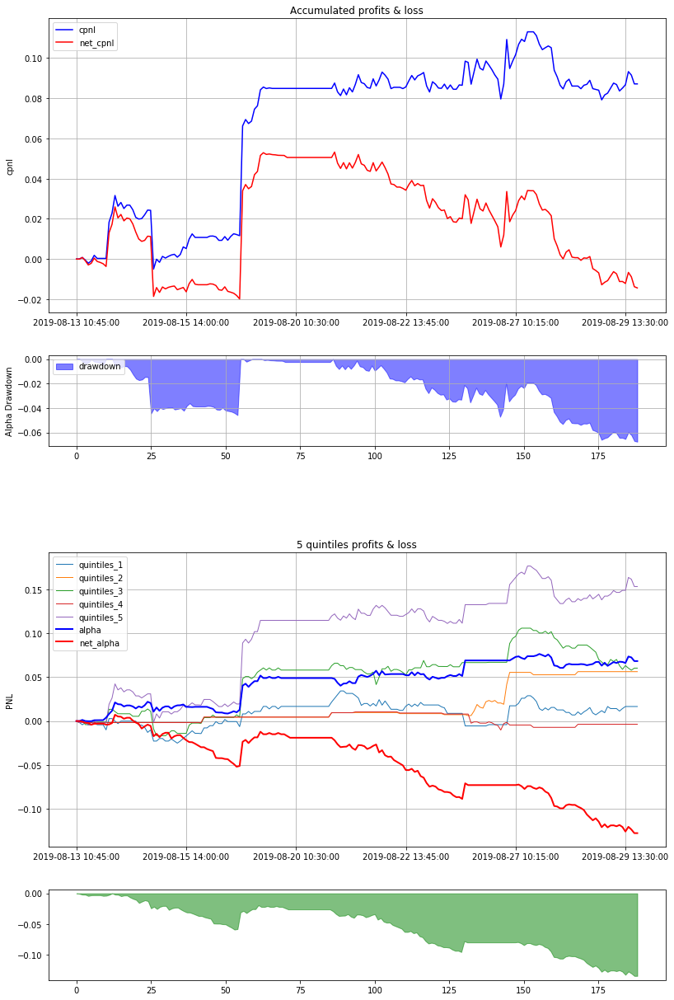

```python
%load_ext autoreload
%autoreload 2
```

## step1 data 


```python
from kitkit.data.pricevolume import PriceVolume
pv = PriceVolume(path='/Users/Hans/Desktop/Kitkit/data/zz500_15min/')
pv.build()
```

    [Data][pricevolume]/Users/Hans/Desktop/Kitkit/data/zz500_15min/


```python
print(pv.dates[0], pv.dates[-1])
```

    2019-07-01 09:30:00 2019-12-23 14:30:00


## step 2 resample


```python
from kitkit.data.resample import Resample
rs = Resample(IS_start='2019-08-12 13:45:00', IS_end='2019-08-30', OOS_start='2019-11-01', OOS_end='2019-12-23', IS_OOS_ratio=None,
                                                tickers=['000008','000009','000012'])

IS_Data, OOS_Data = rs.build(pv)
```

    [data][resample] IS start:2019-08-12 13:45:00 end:2019-08-29 14:15:00
    [data][resample] OOS start:2019-11-01 09:30:00 end:2019-12-20 14:15:00
    tickers quantity: 3


```python
import pandas as pd
pd.DataFrame(IS_Data.ClosePrice, columns=IS_Data.ticker_names, index=IS_Data.dates)
```


<div>
<style scoped>
    .dataframe tbody tr th:only-of-type {
        vertical-align: middle;
    }

    .dataframe tbody tr th {
        vertical-align: top;
    }

    .dataframe thead th {
        text-align: right;
    }
</style>
<table border="1" class="dataframe">
  <thead>
    <tr style="text-align: right;">
      <th></th>
      <th>000008</th>
      <th>000009</th>
      <th>000012</th>
    </tr>
  </thead>
  <tbody>
    <tr>
      <td>2019-08-12 13:45:00</td>
      <td>3.50</td>
      <td>4.26</td>
      <td>3.92</td>
    </tr>
    <tr>
      <td>2019-08-12 14:00:00</td>
      <td>3.50</td>
      <td>4.23</td>
      <td>3.91</td>
    </tr>
    <tr>
      <td>2019-08-12 14:15:00</td>
      <td>3.50</td>
      <td>4.24</td>
      <td>3.90</td>
    </tr>
    <tr>
      <td>2019-08-12 14:30:00</td>
      <td>3.50</td>
      <td>4.26</td>
      <td>3.91</td>
    </tr>
    <tr>
      <td>2019-08-13 09:30:00</td>
      <td>3.48</td>
      <td>4.24</td>
      <td>3.91</td>
    </tr>
    <tr>
      <td>...</td>
      <td>...</td>
      <td>...</td>
      <td>...</td>
    </tr>
    <tr>
      <td>2019-08-29 13:15:00</td>
      <td>3.49</td>
      <td>4.76</td>
      <td>4.25</td>
    </tr>
    <tr>
      <td>2019-08-29 13:30:00</td>
      <td>3.48</td>
      <td>4.83</td>
      <td>4.25</td>
    </tr>
    <tr>
      <td>2019-08-29 13:45:00</td>
      <td>3.48</td>
      <td>4.82</td>
      <td>4.24</td>
    </tr>
    <tr>
      <td>2019-08-29 14:00:00</td>
      <td>3.48</td>
      <td>4.78</td>
      <td>4.25</td>
    </tr>
    <tr>
      <td>2019-08-29 14:15:00</td>
      <td>3.47</td>
      <td>4.80</td>
      <td>4.25</td>
    </tr>
  </tbody>
</table>
<p>198 rows × 3 columns</p>
</div>


## step 3 alpha


```python
from kitkit.alpha.alpha_101 import Alpha_101
alpha = Alpha_101()
alpha = alpha.build(IS_Data)
```


```python
import pandas as pd
a = pd.DataFrame(alpha, columns=IS_Data.ticker_names, index=IS_Data.dates)
a.iloc[9:]
```


<div>
<style scoped>
    .dataframe tbody tr th:only-of-type {
        vertical-align: middle;
    }

    .dataframe tbody tr th {
        vertical-align: top;
    }

    .dataframe thead th {
        text-align: right;
    }
</style>
<table border="1" class="dataframe">
  <thead>
    <tr style="text-align: right;">
      <th></th>
      <th>000008</th>
      <th>000009</th>
      <th>000012</th>
    </tr>
  </thead>
  <tbody>
    <tr>
      <td>2019-08-13 10:45:00</td>
      <td>3.444317e-03</td>
      <td>0.001651</td>
      <td>2.271556e-16</td>
    </tr>
    <tr>
      <td>2019-08-13 11:00:00</td>
      <td>4.022989e-03</td>
      <td>0.002125</td>
      <td>5.117707e-04</td>
    </tr>
    <tr>
      <td>2019-08-13 11:15:00</td>
      <td>3.452244e-03</td>
      <td>0.003308</td>
      <td>5.117707e-04</td>
    </tr>
    <tr>
      <td>2019-08-13 13:00:00</td>
      <td>3.169116e-03</td>
      <td>0.003784</td>
      <td>1.023541e-03</td>
    </tr>
    <tr>
      <td>2019-08-13 13:15:00</td>
      <td>2.595904e-03</td>
      <td>0.003790</td>
      <td>7.678526e-04</td>
    </tr>
    <tr>
      <td>...</td>
      <td>...</td>
      <td>...</td>
      <td>...</td>
    </tr>
    <tr>
      <td>2019-08-29 13:15:00</td>
      <td>1.148106e-03</td>
      <td>0.001895</td>
      <td>7.060485e-04</td>
    </tr>
    <tr>
      <td>2019-08-29 13:30:00</td>
      <td>8.613264e-04</td>
      <td>0.002733</td>
      <td>9.411765e-04</td>
    </tr>
    <tr>
      <td>2019-08-29 13:45:00</td>
      <td>2.871088e-04</td>
      <td>0.003147</td>
      <td>1.647446e-03</td>
    </tr>
    <tr>
      <td>2019-08-29 14:00:00</td>
      <td>1.019723e-15</td>
      <td>0.003144</td>
      <td>9.411765e-04</td>
    </tr>
    <tr>
      <td>2019-08-29 14:15:00</td>
      <td>1.148106e-03</td>
      <td>0.004396</td>
      <td>1.045408e-15</td>
    </tr>
  </tbody>
</table>
<p>189 rows × 3 columns</p>
</div>


## step 4 Deal 


```python
from kitkit.traders.close_deal import CloseDeal
p=CloseDeal(IS_Data, alpha, 10)
p.build()
```

    [Traders][open_deal] maxlookback:10


## step 5 performace


```python
%matplotlib inline
from kitkit.evaluators.alpha_perform import AlphaPerform
ap = AlphaPerform(p, cost=0.002, cycle='15MIN', quintiles_num=5)
ap.build()
```

    [AlphaPerform] start:2019-08-13 10:45:00 end:2019-08-29 14:15:00
       Returns  Net Returns   Cost    Sharpe  Turnover  Max Drawdown  \
         0.087       -0.014  0.102 -0.817972  0.268576        0.0676   
    
      Max DrawdownPeriod  Rsquared        IC     IC IR  Alpha Turnover  \
               102 15MIN  0.003673  0.029913  0.035399           0.519   
    
       Alpha Returns  Alpha Net Returns  Alpha Sharpe  Alpha Net Sharpe  \
               0.068             -0.128         6.906            -11.86   
    
       Alpha Max Drawdown  Alpha Max DrawdownPeriod  Alpha Net Max Drawdown  \
                    0.016                        33                   0.135   
    
       Alpha Net Max DrawdownPeriod  Alpha Rsquared  
                                176           0.838  


    

    


```python
a = {'2':1}
```


```python
a.get('1', 3)
```


    3


```python
import tushare as ts
ts.set_token('95a929d8f6e5e25cc92f81cdab9c6e809b5507664c01bf6b5e3c3645')
pro = ts.pro_api()

df = pro.cctv_news(date='20200305')
```


```python
df

```


<div>
<style scoped>
    .dataframe tbody tr th:only-of-type {
        vertical-align: middle;
    }

    .dataframe tbody tr th {
        vertical-align: top;
    }

    .dataframe thead th {
        text-align: right;
    }
</style>
<table border="1" class="dataframe">
  <thead>
    <tr style="text-align: right;">
      <th></th>
      <th>date</th>
      <th>title</th>
      <th>content</th>
    </tr>
  </thead>
  <tbody>
  </tbody>
</table>
</div>


```python

```
